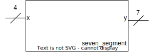

# Décodeur 7 segments
On veut afficher sur l'afficheur sept segments les nombres allant de 0 à 15 en hexadécimal. Pour pouvoir représenter les nombres allant de 0 à 15 il nous faut **4 bits**. Cette entrée on la nommera *x*.

L'afficheur 7 segments comme son nom le dit contient 7 segments qui peuvent être allumés indépendamment. On n'utilisera pas le point décimal **DP** pour cet exercice. À l'aide d'une séquence de segments allumés, on peut représenter les nombres allant de 0 à 15 en hexadécimal qui sont **0, 1, 2, 3, 4, 5, 6, 7, 8, 9, A, B, C, D, E et F**. Il nous faut donc 7 bits pour pouvoir contrôler indépendamment chaque segment. Cette sortie on la nommera *y*.

## Représentation graphique de l'entité **seven_segment**

## Table de vérité

|$$x_{3..0}$$|$$y_{6..0}$$ |
|------------|-------------|
| $$0000_b$$ |$$0111111_b$$|
| $$0001_b$$ |$$0000110_b$$|
| $$0010_b$$ |$$1011011_b$$|
| $$0011_b$$ |$$1001111_b$$|
| $$0100_b$$ |$$1100110_b$$|
| $$0101_b$$ |$$1101101_b$$|
| $$0110_b$$ |$$1111101_b$$|
| $$0111_b$$ |$$0000111_b$$|
| $$1000_b$$ |$$1111111_b$$|
| $$1001_b$$ |$$1101111_b$$|
| $$1010_b$$ |$$1110111_b$$|
| $$1011_b$$ |$$1111100_b$$|
| $$1100_b$$ |$$0111001_b$$|
| $$1101_b$$ |$$1011110_b$$|
| $$1110_b$$ |$$1111001_b$$|
| $$1111_b$$ |$$1110001_b$$|