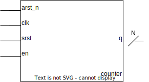

# Compteur
## Table de vérité
|arst_n| clk  |srst|en | q |
|:----:|:----:|:--:|:-:|:-:|
|  0   |  *   | *  | * | 0 |
|  1   |&uarr;| 1  | * | 0 |
|  1   |&uarr;| 0  | 1 |q+1|
|  1   |&uarr;| 0  | 0 | q |

## Représentation graphique de l'entité **counter**
