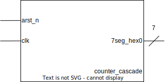

# Cascade de compteurs
## Représentation graphique de l'entité **counter_cascade**

## Schéma fonctionnel du composant **counter_cascade**

On utilise deux compteurs ainsi qu'un décodeur sept segments pour atteindre le résultat demandé dans l'exercice.

Le compteur **u_cnt0** est utilisé pour avoir la base de temps. On l'utilise pour savoir qu'une seconde s'est écroulé. Ce compteur s’incrémente de 1 à chaque front montant d'horloge. Pour savoir qu'une seconde s'est écroulé, il faut qu'on sache combien de fronts montants d'horloge existe dans une seconde en fonction de la fréquence de l'horloge d'entrée. L'horloge d'entrée **clk** a une période de $50 \, MHz$ càd 20 ns de période. Pour déterminer combien de fronts montants d'horloge existe une seconde on utilise la formule suivante : 

$$nb\_fronts\_montants=\frac{1}{période_{clk}} = \frac{1}{\frac{1}{F_{clk}}} = 1 \cdot F_{clk}$$

Application numérique : 
$$nb\_fronts\_montants = 1 \cdot 50 MHz = 50e6$$

Il faut maintenant déterminer le nombre de bits qu'il faut à ce compteur pour atteindre 50e6. Pour cela on utilise la formule suivante : 

$$N = \lceil log2(50e6) \rceil = \lceil\frac{ln(50e6)}{ln(2)}\rceil = 26 \, bits$$

On utilise ensuite un comparateur pour détecter qu'une seconde s'est écroulé. La valeur à comparer sera : 

$$compare\_value = nb\_fronts\_montants - 1 = 49\,999\,999$$

La valeur à être comparé est $49\,999\,999$ car de $0$ à $49\,999\,999$ il existe $50\,000\,000$ intervalles.

On utilise ensuite le résultat de la comparaison pour incrémenter le compteur **u_cnt1** et remettre à $0$ le compteur **u_cnt0** pour repartir sur une nouvelle mesure d'une seconde.

On remet à $0$ le compteur **u_cnt0** de façon synchrone pour que le résultat de la comparaison soit vrai pendant minimum une période d'horloge de *clk* et que l'entrée **en** de **u_cnt1** reste à $1$ suffisamment longtemps pour qu'elle soit vue à $1$ lors du prochain front montant d'horloge.

On instancie un décodeur sept segments **seven_segment** pour décoder la valeur du compteur **u_cnt1** et l'afficher dans un afficheur sept segments.