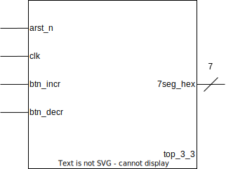

# Machine à états
## Représentation graphique de l'entité **top_3_3**

## Ajout de la fonctionnalité décrémentation du compteur
Pour pouvoir répondre à l’énoncé de l'exercice, il faut ajouter au compteur de l'exercice 3.1, la possibilité de se décrémenter à l'aide d'une entrée supplémentaire qui aura comme nom **ud** et aura pour rôle d'indiquer la direction de comptage.

### Représentation graphique de l'entité **counter** avec le signal de direction de comptage

### Table de vérité de **counter** avec le signal de direction de comptage

|arst_n| clk  |srst| en | ud | q |
|:----:|:----:|:--:|:--:|:--:|:-:|
|  0   |  *   | *  | *  | *  | 0 |
|  1   |&uarr;| 1  | *  | *  | 0 |
|  1   |&uarr;| 0  | 1  | 0  |q+1|
|  1   |&uarr;| 0  | 1  | 1  |q-1|
|  1   |&uarr;| 0  | 0  | *  | q |

## Machine à états pour un bouton

La machine a états contient deux états. Un état button relâché "*released*" et un autre bouton appuyé "*pressed*" avec l'état initial de bouton relâché "*released*". La sortie *press_event* recopie la valeur du bouton *btn* lorsque la machine à états se trouve dans l'état *released*. La sortie *press_event* vaudra $1$ lorsqu'on quitte l'état *released*.

###  Chronogramme de la machine à états

### Représentation graphique de l'entité **fsm_btn**

## Schéma fonctionnel du composant **top_3_3**
